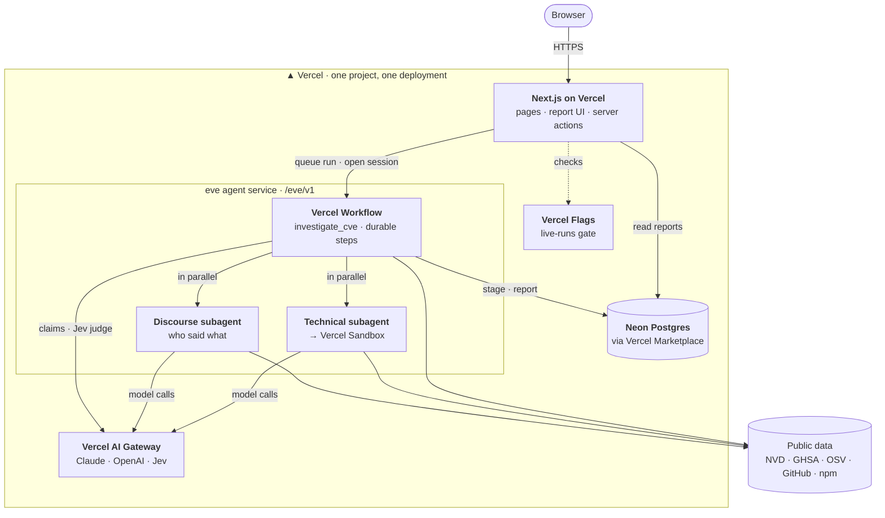

# TOTS

**Is this CVE real for this package version?**

**Live:** [tots-security.vercel.app](https://tots-security.vercel.app) · [How it works](https://tots-security.vercel.app/how-it-works)

A published CVE can still be disputed, overstated, or wrongly scoped. Scanners repeat it, maintainers argue with it, and the affected version range drifts between databases. TOTS takes one CVE and one package version and answers the two questions a security engineer would ask:

1. **Does the code actually do this?** An agent reproduces it in an isolated sandbox.
2. **What do the people who own it say?** A second agent collects maintainer, database, and vendor statements, each with a verbatim quote and a link.

A judge model scores the evidence, and a fixed, auditable policy turns those scores into a label.

Built with [eve](https://eve.dev/docs), Vercel's framework for durable agents, and deployed as a single Vercel project.

## How it works

```
CVE + package@version
        │
  01  Record      NVD + GitHub Advisories + OSV over plain HTTP (no LLM).
        │         Each source keeps its own version range; disagreement is evidence.
  02  Claims      Split the description into atomic claims, plus
        │         "<package@version> is affected"
        ├──────────────────────────────┐   in parallel, neither sees the other
  03a Technical investigator      03b Discourse investigator
      Vercel Sandbox: install          GitHub issues/PRs, advisories, vendor notes.
      target + fixed + positive        Who said what, their role (GitHub's own
      control, read the patch,         maintainer marker), verbatim quote, link.
      run one PoC against all.
        ├──────────────────────────────┘
  04  Judge       Jev answers typed questions (affected? reproduced? credible
        │         dispute? how authoritative?) with probabilities, not prose.
  05  Policy      Fixed thresholds → label. Every report shows the rule that fired.
```

### Design decisions

- **The investigators are independent.** The technical agent's `web_fetch` refuses GitHub issue and discussion pages, so opinions can't leak into the PoC verdict.
- **Positive controls.** A PoC that fails on the target only counts if it succeeds on a known-vulnerable version.
- **The judge judges.** Jev never investigates. It scores evidence that the investigators already gathered.
- **No model picks the label.** Deterministic code maps Jev's probabilities to a label, and every report shows the policy trace.
- **Claim by claim.** Each claim in the CVE gets its own verdict, so "the bug is real but this version range is wrong" is a result TOTS can give.
- **The official status stays visible.** TOTS doesn't override the CVE Program; it shows the official status next to its own assessment.

## Built on Vercel

Everything runs in one Vercel project. The Vercel services authenticate with the project's OIDC token, so there are no AI provider keys to manage.



| | |
|---|---|
| **eve** | Durable agent runtime: the orchestrating workflow tool and both subagents |
| **Vercel Workflow** | Each run is a durable workflow, so a crash or redeploy resumes it mid-step |
| **Vercel Sandbox** | Isolated microVMs for PoCs, with network egress limited to npm and GitHub |
| **Vercel AI Gateway** | Claude (investigators), OpenAI (claim decomposition), Jev (judge) |
| **Vercel Flags** | `live-runs` gates new investigations; off in production by default |
| **Neon via Vercel Marketplace** | Postgres for runs, stages, labels, and full reports |
| **Next.js on Vercel** | The UI, deployed alongside the agent with `withEve` |

The public agent endpoint accepts anonymous requests. Only a flag-checked server action can create a `queued` run, and the workflow only executes runs it can atomically claim from `queued`, so the open endpoint can't start an investigation on its own. A Vercel Firewall rule also rate-limits `/eve/v1` per IP.

See [PLAN.md](PLAN.md) for the full design and build notes.

## Run it locally

Requires Node.js 24, pnpm, and a linked Vercel project with AI Gateway credits, Neon, and Vercel Flags.

```sh
pnpm install
vercel link && vercel env pull     # OIDC token, DATABASE_URL, FLAGS_SECRET, GITHUB_TOKEN
pnpm db:migrate
TOTS_MODELS=gateway pnpm dev       # http://localhost:3000 (agent at /eve/v1)
pnpm seed                          # run both example cases
```

```sh
pnpm typecheck
pnpm test                          # policy unit tests
pnpm eval -- --url http://localhost:3000   # eve evals: one per case, plus quote provenance
```

## Project layout

```
agent/
  tools/investigate_cve.ts   the durable pipeline
  subagents/technical/       sandbox PoC investigator
  subagents/discourse/       who-said-what investigator
  lib/                       records, claims, judge, policy, schemas (shared with the UI)
app/                         Next.js UI: list, report pages, How it works
evals/  tests/  db/migrations/  scripts/
```

## Where this could go

- **A threat-intel feed.** `GET api.tots.dev/CVE-2024-10491?purl=pkg:npm/express@5.2.1` → label plus evidence, for scanners and SBOM tools to query before raising an alert.
- **VEX output.** Emit CycloneDX/OpenVEX statements from the label, so the assessment travels with the SBOM.
- **In the pull request.** A GitHub app that comments the TOTS label on Dependabot and scanner PRs.
- **Watch mode.** Scheduled re-checks when a fix ships, a range changes, or a maintainer weighs in.

## License

Apache 2.0
